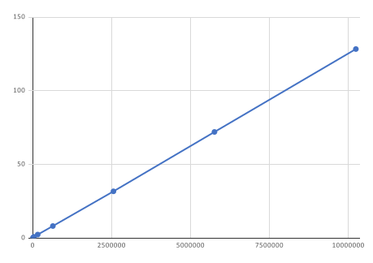

# DBSCAN Clustering Implementation Using a Kd Tree

UNDER CONSTRUCTION

The code included here implements the popular DBSCAN clustering algorithm [1] in Java.  This implementation uses a k-d tree to accelerate the process of building the clusters.  The k-d tree code is also presented here.  Using a k-d tree improves the performance of the clustering in two essential ways.

First, the k-d implementation is highly optimized to build and search the tree using multithreading, significantly reducing the time needed for window searches.

Second, it supports removing cluster items from the k-d tree after the cluster items are added to a cluster.  Each cluster item is considered only once and does not have to be tagged as having been previously clustered.  In addition, as the k-d tree decreases in size, the searches speed up.

## Usage

This implementation assumes that there is an array of objects where each object has some multidimensional geometric or other data that will be used for classification.  The geometric data is submitted to the k-d tree as the key along with the index as the value.  At the end of the clustering process, The DBSCAN\_clusers object holds an array of clusters.   Each cluster holds an array of indices of points in the original array.

In the example below that data is stored as a class in the Locations class.  The usage steps are as follows:

1. Create an instance of the KdTreeEx class.
2. Loop through each Location in Locations.  Read out the geometric data from the array and add it to the KdTree object as the key and using the index of that Location in the Locations object as the value.
3. Build the KdTree.
4. Create an instance of the DBSCANClusters class.
5. Call the build method with the build k-d tree and the search window
6. Call the checkCluster function to get the statistics of the clustering

Cluster objects are in the dbscan\_clusters.cluster array list. Each cluster object contains an array of indices back to the Locations object. It also can contain bounds of that data

This source code example below can be found in the main function in DBSCANClusters.Java

**(1.)**

**long** [] latLonTime = **new long** [3];

KdTreeEx\&lt;Integer\&gt; fKdTree = **new** KdTreeEx\&lt;Integer\&gt;(( **int** )locations.size(), 3);

fKdTree.setNumThreads(Runtime._getRuntime_().availableProcessors());

**(2.)**

**for** ( **int** idx = 0;  idx \&lt; locations.size(); idx++){

   _// feed the kdTree_

_   _latLonTime[0] = locations.get(idx).getLatitudeE7();

   latLonTime[1] = locations.get(idx).getLongitudeE7();

   latLonTime[2] = locations.get(idx).getTimeStampLong();

    **if** (0 \&gt; fKdTree.add(latLonTime, idx)) {

       System. **out**.println( **&quot;fKdTree data input error at &quot;** + idx);

   }

}

**long** overallTime = System._currentTimeMillis_();

**(3.)**

fKdTree.buildTree();

**(4.)**

_// create a DBSCAN\_Clusters object and override the getPoint fuction to get access to the location data._

DBSCAN\_Clusters visitCluster = **new** DBSCAN\_Clusters(3);

**long** clusterTime = System._currentTimeMillis_();

_// get the search range to about cluster distance window_

**long** [] window = {searchRad, searchRad,searchRad};

**(5.)**

_// step through every point to make sure it&#39;s been added to a cluster._

visitCluster.buildCluster(fKdTree, window);

**long** currentTime =  System._currentTimeMillis_();

**final double** sC = ( **double** ) (currentTime - clusterTime) / 1000.;

**final double** sO = ( **double** ) (currentTime - overallTime) / 1000;

System. **out**.printf( **&quot;Cluster time = %.3f**** \n ****&quot;** , sC);

System. **out**.printf( **&quot;Overall time = %.3f**** \n ****&quot;** , sO);

**(6.)**

**if** (!visitCluster.checkClusters(( **int** )locations.size())) {

   System._exit_(1);

}

## Notes on Implementation

The DBSCAN clustering algorithm  works as follows

1. Choose an arbitrary point from the dataset of items
2. Use it to seed a new cluster.
3. Loop on all items in the cluster
  1. Search for items in the data set that are within a search window of the point
  2. Add any points returned from that search to the cluster and mark them in some way so that they are not included in future searches.
  3. When all the items in the current cluster have been searched against the data set, exit the loop.  This means there are no more items in the dataset that are within a search window of any of the points in this cluster.
4. Choose the next arbitrary point in the dataset that has not been added to a cluster and go back to step 2.  If there are no more points, the process is complete.

Using the k-d tree for the above algorithm helps in the following ways.

1. Searching the data set that is contained in the k-d tree is very efficient.  The k-d tree includes a function that returns all points in the tree which is within a hypercube window which is multithreaded so handles large trees very well.
2. There is a remove method that removes items from the k-d tree.  Other descriptions of DBSCAN algorithms such as [https://en.wikipedia.org/wiki/DBSCAN](https://en.wikipedia.org/wiki/DBSCAN) talk about tagging each item added to a cluster so that it can be ignored if it is returned in a future dataset search.  But by deleting the item from the k-d tree, that item will never show up in a future sort, so tagging is not necessary.
3. The KdTreeEx class has a method that chooses an arbitrary item from the k-d tree and removes it from the tree at the same time.  This makes it easy to find the items to seed a new cluster within that it will only choose items that have not been deleted.

## Performance

The tests run on the simple dataset generated in main() show that removing data from the k-d tree as they are added to a cluster, results in a near-linear performance as a function of data points in the dataset.  Note that building the k-d tree is O(kn log n) but so the overall time can&#39;t exactly linear but the k-d tree build time is only about 10% of the tests.

That result is somewhat surprising since the search of the k-d tree is a log n process because the depth of a balanced tree is log2 n.  An argument for why this algorithm exhibits O(n) performance is this:

At the beginning when the k-d tree is still relatively full, each search requires log2(n) operations but the number of items returned with each search is likely large, probably larger than log2(n).  As the number of points in the tree reduces, the depth of the tree reduces.  So does the number of points returned from each search.  As long as the number of points returned from the search is linearly related to the depth of the tree, the performance will be linear.  And since there is no attempt to rebalance the k-d tree, the reduction in the depth of the tree happens locally and in the region of the cluster.

| Clusters | Point per | Total Points | Seconds |
| --- | --- | --- | --- |
| 100 | 100 | 10000 | 0.3 |
| 200 | 200 | 40000 | 0.861 |
| 400 | 400 | 160000 | 2.382 |
| 800 | 800 | 640000 | 8.181 |
| 1600 | 1600 | 2560000 | 31.752 |
| 2400 | 2400 | 5760000 | 72.082 |
| 3200 | 3200 | 10240000 | 128.382 |

Of course, less evenly distributed data will probably show less linear growth but the deleting the items from the k-d tree will always help.

## Notes on the KdTree Implementation

The code included here is an implementation of the algorithm described in [2] by that author.  That code can be found at other places on the Web.  The version included here has the following improvements.

1. Four versions of the merge sort algorithm wherein the merge step (1) copies from array A to array B, or from array B to array A, but not from array A to array B and then back to array A; and (2) avoids time-consuming array-bounds tests by cleverly reversing the order of one of arrays A and B [3].

1. Using two threads for the merge step of the merge sort algorithm, as well as for the partitioning step of the tree-building algorithm, wherein either step proceeds from both the start and end of an array concurrently.  These are straightforward ways to break up the work into multiple threads without a pre-operation to split up the work or a post-operation to recombine the results.

1. A set of API methods added to the enclosing class to make easier to use by an application.

1. The remove() method and pick() method.

1. Various other performance improvements and bug fixes.

## References

[1] Ester, Martin; Kriegel, Hans-Peter; Sander, Jörg; Xu, Xiaowei (1996). Simoudis, Evangelos; Han, Jiawei; Fayyad, Usama M. (eds.). A density-based algorithm for discovering clusters in large spatial databases with noise. Proceedings of the Second International Conference on Knowledge Discovery and Data Mining (KDD-96). AAAI Press. pp. 226–231. CiteSeerX 10.1.1.121.9220. ISBN 1-57735-004-9.

[2] Russell A. Brown, Building a Balanced k-d Tree in O(kn log n) Time, Journal of Computer Graphics Techniques (JCGT), vol. 4, no. 1, 50-68, 2015.

[3] Robert Sedgewick. Optimized Implementations, in Algorithms in C++, 173-174, Addison-Wesley, New York, 1992.
