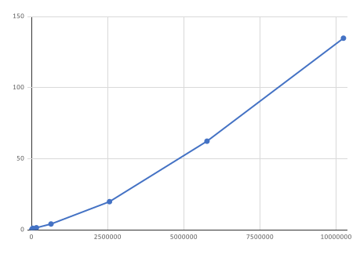
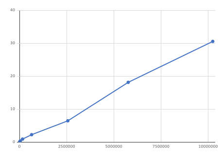

# DBSCAN Clustering Implementation Using a K-d Tree

The code included here implements the popular DBSCAN clustering algorithm [1] in Java.  This implementation uses a k-d tree to accelerate the process of building the clusters.  The k-d tree code is also presented here.  Using a k-d tree improves the performance of the clustering in two essential ways.

First, the k-d tree code presented here is highly optimized to build and search the tree using multithreading, significantly reducing the time needed for window searches.

Second, it supports removing cluster items from the k-d tree after the cluster items are added to a cluster.  Each clustered item is considered only once and does not have to be tagged as having been previously added to a cluster.  Also, as the k-d tree decreases in size, the searches speed up.

## Usage

This implementation assumes that there is an array of objects where each object has some multidimensional geometric or other data that will be used for classification.  The geometric data is submitted to the k-d tree as the key along with the index as the value.  At the end of the clustering process, The DBSCAN\_clusers object holds an array of clusters.   Each cluster holds an array of indices of points in the original array.

In the example below that data is stored as a class in the Locations class.  The usage steps are as follows:

1. Create an instance of the KdTreeEx class.
2. Loop through each Location in Locations.  Read out the geometric data from the array and add it to the KdTree object as the key and using the index of that Location in the Locations object as the value.
3. Build the KdTree.
4. Create an instance of the DBSCANClusters class.
5. Call the build method with the build k-d tree and the search window
6. Call the checkCluster function to get the statistics of the clustering

Cluster objects are in the DBSCAN\_clusers.clusters array list. Each cluster object contains an array of indices back to the Locations object. It also can include bounds of that data.

This source code example below can be found in the main function in DBSCANClusters.Java

```java
(1.)
long[] latLonTime = new long[3];
KdTreeEx<Integer> fKdTree = new KdTreeEx<Integer>((int)locations.size(), 3);
fKdTree.setNumThreads(Runtime.getRuntime().availableProcessors());
(2.)
for (int idx = 0;  idx < locations.size(); idx++){
   // feed the kdTree
   latLonTime[0] = locations.get(idx).getLatitudeE7();
   latLonTime[1] = locations.get(idx).getLongitudeE7();
   latLonTime[2] = locations.get(idx).getTimeStampLong();
   if (0 > fKdTree.add(latLonTime, idx)) {
       System.out.println("fKdTree data input error at " + idx);
   }
}
long overallTime = System.currentTimeMillis();
(3.)
fKdTree.buildTree();

(4.)
// create a DBSCAN_Clusters object.
DBSCAN_Clusters visitCluster = new DBSCAN_Clusters(3);

long clusterTime = System.currentTimeMillis();
// get the search range to about cluster distance window
long[] window = {searchRad, searchRad,searchRad};
(5.)
// step through every point to make sure it's been added to a cluster.
visitCluster.buildCluster(fKdTree, window);

long currentTime =  System.currentTimeMillis();
final double sC = (double) (currentTime - clusterTime) / 1000.;
final double sO = (double) (currentTime - overallTime) / 1000;
System.out.printf("Cluster time = %.3f\n", sC);
System.out.printf("Overall time = %.3f\n", sO);
(6.)
if (!visitCluster.checkClusters((int)locations.size())) {
   System.exit(1);
}

```

## Notes on Implementation

The DBSCAN clustering algorithm  works as follows

1. Choose an arbitrary point from the dataset of items
2. Use it to seed a new cluster.
3. Loop on all items in the cluster
  1. Search for items in the data set that are within a search window of the point
  2. Add any points returned from that search to the cluster and mark them in some way so that they are not included in future searches.
  3. When all the items in the current cluster have been searched against the data set, exit the loop.  This means there are no more items in the dataset that are within a search window of any of the points in this cluster.
4. Choose the next arbitrary point in the dataset that has not been added to a cluster and go back to step 2.  If there are no more points, the process is complete.

Using the k-d tree for the above algorithm helps in the following ways.

1. Searching the data set that is contained in the k-d tree is very efficient.  The k-d tree includes a function that returns all points in the tree, which is within a hypercube window, which is multithreaded, so handles large trees very well.

2. There is a remove method that removes items from the k-d tree.  Other descriptions of DBSCAN algorithms such as [https://en.wikipedia.org/wiki/DBSCAN](https://en.wikipedia.org/wiki/DBSCAN) talk about tagging each item added to a cluster so that it can be ignored if it is returned in a future dataset search.  But by deleting the item from the k-d tree, that item will never show up in a future search, so tagging is not necessary.
3. The KdTreeEx class has a method that chooses an arbitrary item from the k-d tree and removes it from the tree at the same time.  This method makes it easy to find the items to seed a new cluster with, in that it will only choose items that have not been deleted.


### Differences fro Original Paper

This implementation uses a hypercube search instead of a radial search to search for adjacent objects to add to a cluster.  An additional search method could be added to the KdTree class to test against the radial distance from the center instead of being inside the hypercube.  Because of the sum of squares calculation required for a radial distance test, this choice of search kernel will be slower.  Of course, it depends on the particular needs.

Another difference is that this code does not explicitly implement the noise part of DBSCAN.  It would be easy to add a Min Cluster size parameter to buildClusters() method.  Or a &quot;noise&quot; tag could be added to each cluster by looping over the clusters in the DBSCAN\_Clusters.clusters list.  There is a sort() method that sorts clusters by size in the DBSCAN\_Cluster class, which could aid in doing that tagging.

## Performance

A comparison of the two charts below shows the increase in performance that can be attained by deleting items from the k-d tree using the simple test case coded in DBSCAN\_Clusters.main().  All times shown below include the k-d tree build.

The charts marked as Used Tagging Performance show the performance of an implementation where the k-d tree is searched to find the adjacent items in a cluster, but a record is kept to identify items that have been added to a cluster.  When the k-d tree search returns an item that has already been clustered, it is ignored.  This is a more typical implementation, and the code for that is not included in this repository.  Note the O(nlogn) grown law expected for this method.

| Cluters | Point per | Total Point | Seconds |
| --- | --- | --- | --- |
| 100 | 100 | 10000 | 0.3468 |
| 200 | 200 | 40000 | 1.156 |
| 400 | 400 | 160000 | 1.5408 |
| 800 | 800 | 640000 | 4.1802 |
| 1600 | 1600 | 2560000 | 19.8892 |
| 2400 | 2400 | 5760000 | 62.4002 |
| 3200 | 3200 | 10240000 | 134.8298 |


#### Figure 1. Used Tagging Performance

The charts marked Deleted Nodes Performace are for the implementation described above.  Not only does it show a 3 to 4x improvement in performance, but the performance improves with increasing points or items, and for the simple cases run here, it is sub-linear.

| Cluters | Point per | Total Point | Seconds |
| --- | --- | --- | --- |
| 100 | 100 | 10000 | 0.1024 |
| 200 | 200 | 40000 | 0.368 |
| 400 | 400 | 160000 | 0.919 |
| 800 | 800 | 640000 | 2.2598 |
| 1600 | 1600 | 2560000 | 6.466 |
| 2400 | 2400 | 5760000 | 18.14 |
| 3200 | 3200 | 10240000 | 30.5544 |


#### Figure 2. Deleted Node Performance

Of course, less evenly distributed data will probably show less linear growth, but deleting the items from the k-d tree will always help.

## Notes on the KdTree Implementation

The code included here is an implementation of the algorithm described in [2] by that author.  That code can be found at other places on the Web.  The version included here has the following improvements.

1. Four versions of the merge sort algorithm wherein the merge step (1) copies from array A to array B, or from array B to array A, but not from array A to array B and then back to array A; and (2) avoids time-consuming array-bounds tests by cleverly reversing the order of one of arrays A and B [3].

1. Using two threads for the merge step of the merge sort algorithm, as well as for the partitioning step of the tree-building algorithm, wherein either step proceeds from both the start and end of an array concurrently.  These are straightforward ways to break up the work into multiple threads without a pre-operation to split up the work or a post-operation to recombine the results.

1. A set of API methods added to the enclosing class to make it easier to use by an application.

2. searchTree() method rewritten to be more efficient.

1. The remove() method and pick() method.

1. Various other performance improvements and bug fixes.

## References

[1] Ester, Martin; Kriegel, Hans-Peter; Sander, Jörg; Xu, Xiaowei (1996). Simoudis, Evangelos; Han, Jiawei; Fayyad, Usama M. (eds.). A density-based algorithm for discovering clusters in large spatial databases with noise. Proceedings of the Second International Conference on Knowledge Discovery and Data Mining (KDD-96). AAAI Press. pp. 226–231. CiteSeerX 10.1.1.121.9220. ISBN 1-57735-004-9.

[2] Russell A. Brown, Building a Balanced k-d Tree in O(kn log n) Time, Journal of Computer Graphics Techniques (JCGT), vol. 4, no. 1, 50-68, 2015.

[3] Robert Sedgewick. Optimized Implementations, in Algorithms in C++, 173-174, Addison-Wesley, New York, 1992.
